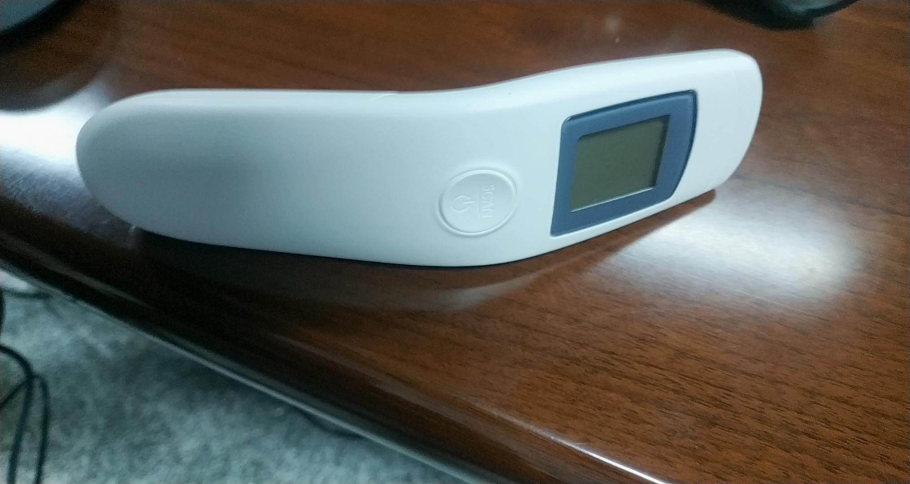

## 主机

### 首页

> 登录系统后的页面

* 点击上方右侧的医生名可以切换卫生院的医生。
* 点击首页可以进入首页，有快捷入口。
* 点击拍照 可以使用前后摄像头来拍一张照片并保存，点击右边按钮进行查看。
* 首页的快捷入口中有常用的功能。

### 档案信息（登录状态）
> 登录者的相关健康信息

#### 个人档案
> 个人信息

* 姓名，地址，职业，血型等基本信息
* 支付方式
* 药物过敏史
* 人群分类
* 暴露史
  
> 健康信息

* 疾病的确诊记录
* 疾病的治疗类别记录
* 残疾情况
* 遗传信息
* 家庭环境
* 地方性患者健康管理

#### 家庭档案
> 家庭情况及环境，添加家庭成员 

#### 健康体检
> 添加体检记录并可以同通过日期来进行查找

#### 转诊记录管理
> 添加转诊记录（转入和转出），可以通过转诊时间来进行查找。

#### 接诊记录管理
> 添加接诊记录并可以通过接诊时间来进行查找

#### 个体化健康教育
> 添加个体化健康教育记录并可以通过录入时间进行查找。

#### 个性化健康教育处方
> 添加个体化健康教育处方记录并可以通过创建时间进行查找。

### 随访调查（登陆状态）
> 对病人的随访记录进行管理

#### 高血压高危人群
> 添加与高血压有关的生活习惯，改善目标，下次随访时间有关的记录，通过随访时间进行查找

#### 健康养老需求
> 添加老人的基本信息的记录作为评估，通过录入时间进行查找。

#### 护理服务需求
> 将老人的日常生活能力，精神状况与社会参与能力，感知与沟通能力，老年症状信息录入，进行评分，分数越高，情况越严重，由医生根据评分填写护理服务需求评定，可通过录入时间进行查找。

### 统计分析
> 用来对已有的数据进行查找，导出等操作。

#### 档案查询
> 通过身份证号等搜索条件查找出所有符合条件的居民记录，可以导出数据和更改上传的状态

#### 体检查询
> 通过身份证号、姓名、随访医生等信息查找出符合条件的体检记录。

#### 条形码打印查询
> 通过体检时间筛选出符合条件的条形码打印记录。

#### 随访查询
> 通过随访类型、身份证号、姓名等搜索条件筛选出符合条件的随访记录，可将随访记录的详细信息导出

#### 签约查询
> 通过团队名称、签约人、签约人身份证号等搜索条件筛选出符合条件的签约记录。

#### 转诊查询
> 通过姓名、类型、接诊医院等搜索条件来筛选出符合条件的转诊记录

#### 家庭档案查询
> 通过户主姓名或身份证号等筛选条件筛选出符合条件的家庭档案记录。

#### 上传下载信息查询
> 查找上传下载记录。

#### 健康教育处方查询
> 查找健康教育处方记录

#### 体检缺项查询
> 查找体检缺项记录

#### 心电审查
> 查找心电审查记录

### 数据导出
> 信息的导出

#### 体检导出
> 体检详细信息的导出

### 健康教育活动
> 添加并查找健康教育记录

### 中医药健康管理
> 病人中医方面的记录

#### 65岁以下中医药基本体质辨识
> 添加随访记录，录入信息，通过随访时间查看。

#### 中医药高血压登记本
> 查看病人中医药高血压登记记录

#### 中医药糖尿病登记本
> 查看病人中医药高血压登记记录

### 卫生监督协管服务

#### 卫生监督协管报告
> 添加和搜索卫生监管协管报告。

#### 卫生监督协管巡查
> 添加和搜索卫生监管协管巡查。

### 心电检测
> 新建心电检测任务，查看心电图，输入分析结果。

### 指纹管理
> 对用户的指纹进行管理，可用于登录。

### 纸质档案

#### 纸质档案（登录状态）

#### 多人纸质档案

### 条码打印
> 选中要检查的项目，生成用于检查的条形码或二维码

#### 条码打印（登录状态下使用）

#### 身份证条码打印（未登录状态下使用）

### 家庭签约
> 家庭与医生团队进行签约服务

#### 医生团队

#### 家庭档案

#### 家庭签约

#### 个人签约

### 数据上传/下载
> 填写信息的上传和下载

## 常规体检终端

+ 扫码,信息录入计算机，之后的体检数据会自动记录
+ 测量身高体重
--- 

+ 测体温 
---

**其他数据手动输入，点击‘保存’保存到本地数据库，点击‘数据上传’上传到主机数据库。**

## 老年人健康问诊终端
> 数据手动输入，点击‘保存’保存到本地数据库，点击‘数据上传’上传到主机数据库。

## 中医体质辨识终端
> 数据手动输入，点击‘保存’保存到本地数据库，点击‘数据上传’上传到主机数据库。

## 心电检查终端
> 数据手动输入，点击‘保存’保存到本地数据库，点击‘数据上传’上传到主机数据库。

## 尿液检测终端

**点击‘保存’保存到本地数据库，点击‘数据上传’上传到主机数据库。**

